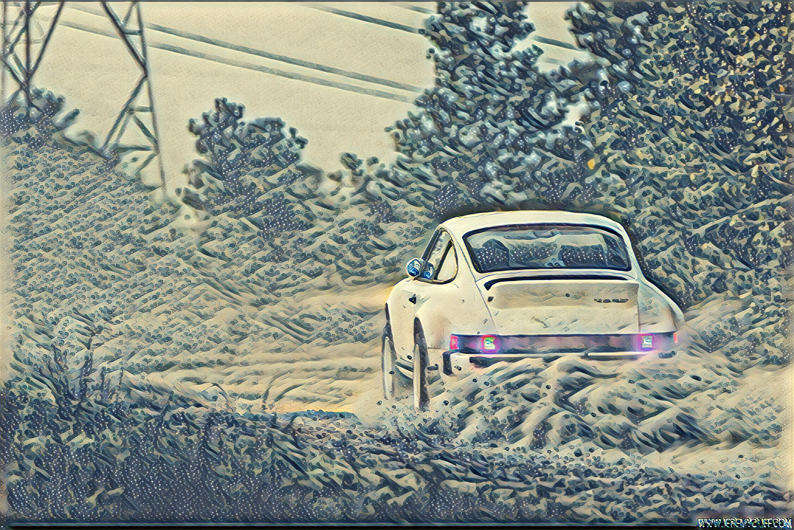
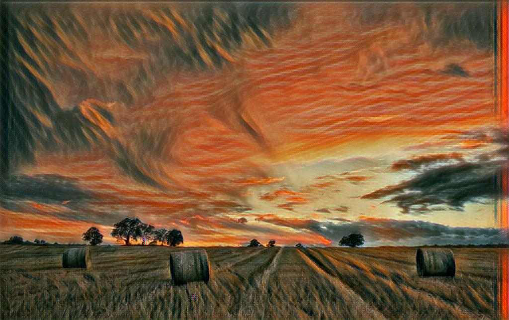
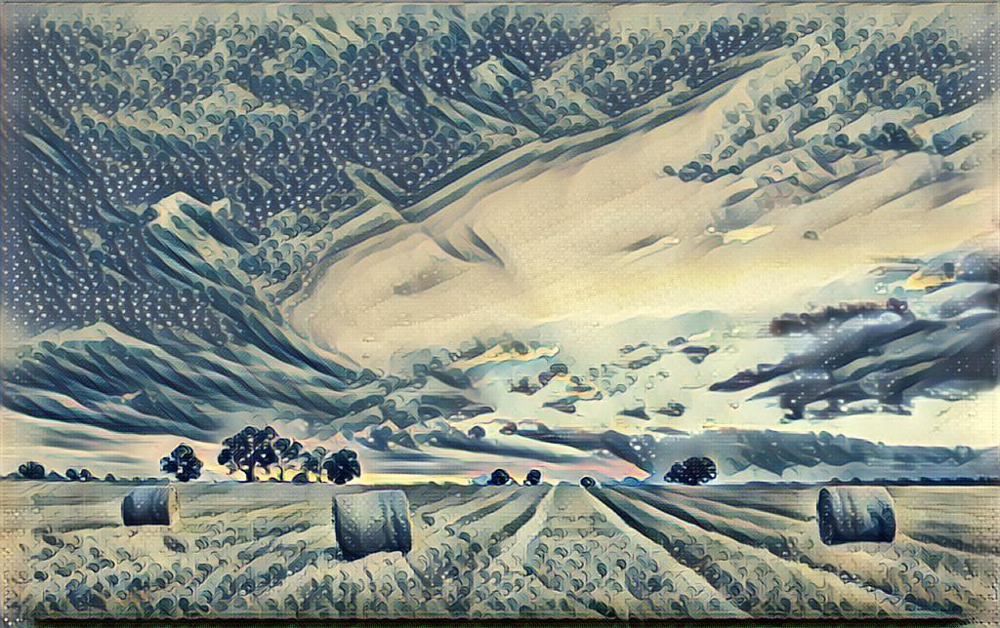
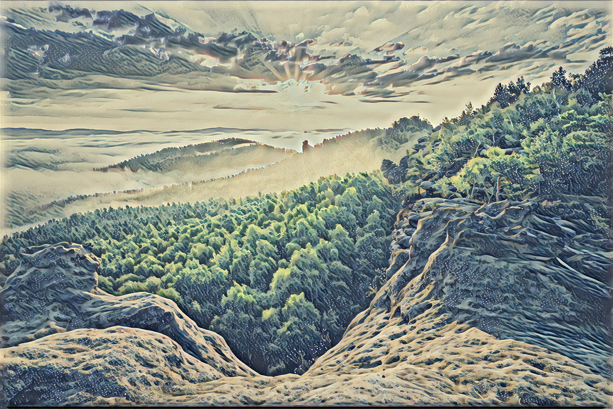

# style_transfer
all different ways of style transfer


#### style_net borrowed a lot code from https://github.com/lengstrom/fast-style-transfer


### download pretrained models 
```
##down load model ckpt files into model folder 
cd style_net/model 
wget https://www.dropbox.com/s/one2ibrtro7tiuv/style_model.tar.gz
tar -xzf style_model.tar.gz
rm style_model.tar.gz
```

#### Some results 
<p align = 'center'>


</p>
<p align = 'center'>



</p>
<p align = 'center'>




</p>
<p align = 'center'>



</p>

### high level api

```
from style_net import inference
import matplotlib.pyplot as plt

options = {'checkpoint': 'style_net/training_model',
         'device': '/gpu:0'
         }

img = 'style_net/examples/content/chicago.jpg'
net = inference.net(options)

result = net.predict(img)
plt.imshow(result)
net.save('test.jpg',result)
```

